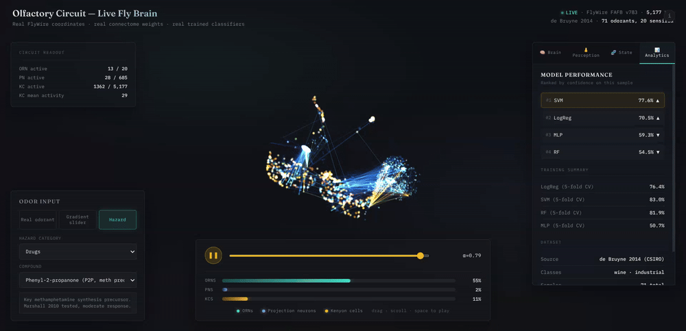

# Olfactory Pipeline — FlyWire Connectome-Based Chemical Classification

**🔗 [Try the live 3D brain viewer →](https://raomuhammadumar.github.io/flywire-odor-classifier/viz/)**

*Click the animation to open the live demo. Real FlyWire neuron positions, real connectome weights, live predictions from 4 trained classifiers.*

---

## 🧠 Live 3D brain viewer

An interactive visualization of a fruit fly's olfactory circuit, running entirely in the browser. Every neuron is plotted at its **actual 3D position** from the FlyWire FAFB reconstruction (139,255 neurons total). Circuit weights come from the **real connectome** — synapse counts from electron microscopy.

### What you can do

- **Real odorant mode** — pick any of the 71 chemicals from the de Bruyne 2014 electrophysiology dataset and watch the circuit respond
- **Gradient slider** — smoothly interpolate between a wine prototype and an industrial prototype, watching the brain morph
- **Hazard mode** — select from explosives, drug precursors, toxic industrial chemicals, and radioactive compounds. Each fires a distinct ORN → PN → KC pattern through the real circuit
- **Auto-play** — press the play button (or spacebar) to cycle through all samples
- **Four analysis tabs** — Brain (live predictions), Perception (what the fly smells), State (neural state classifier), Analytics (model performance)

### What you see in the 3D scene

| Element | Description |
|---|---|
| **Cyan points** | 915 olfactory receptor neurons (ORNs), clustered in the antennal lobe |
| **Blue points** | 685 projection neurons (PNs), relaying to the mushroom body |
| **Amber points** | 5,177 Kenyon cells (KCs), the mushroom body's sparse coding layer |
| **Bright lines** | Actual synaptic connections from the connectome, colored by signal strength |

The viewer animates per-frame stochastic spiking. Firing probabilities come from the real activity of each odorant, but the exact spike timings are generated, not recorded.

---

## What this project does

1. Extracts the olfactory circuit (ORN → PN → Kenyon Cell) from the real FlyWire connectome.
2. Loads real measured ORN responses (71 odorants × 20 sensilla) from the de Bruyne 2014 dataset.
3. Pushes ORN responses through the connectome to produce Kenyon Cell representations.
4. Trains 4 classifiers on both raw ORN features and connectome-derived KC features.
5. Reports honest cross-validated accuracy with shuffled-label controls.
6. Visualizes the entire pipeline in an interactive 3D viewer.

---

## Headline result

We ran two evaluations. Both point the same direction.

### 1. Connectome comparison (5-fold CV on all 71 samples)

| Feature set | Best model | Accuracy |
|---|---|---|
| Raw ORN (20-D) | SVM | **83.0%** |
| Connectome-derived KC (5,177-D) | RF | 81.9% |
| Shuffled-label control | — | ~50% (chance) |

The connectome did **not** improve classification. The signal is already present at the receptor level, and the mushroom body's sparse expansion coding did not amplify it on this dataset. **An honest negative result.**

### 2. Held-out test (single 80/20 split, 15 samples never seen in training)

| Model | Accuracy |
|---|---|
| LogReg | 93.3% (14/15) |
| SVM | 93.3% (14/15) |
| RF | 86.7% (13/15) |
| MLP | 60.0% (9/15) |

See **DATA.md** for what every dataset, column, and number means.

---

## Results figures

### Model accuracy on the held-out test set

### Behavior along the wine → industrial gradient

*Synthetic samples generated by `generate_dummy.py`. Each model's probability of predicting "industrial" per sample — a smooth curve means the model interpolates sensibly between the two class prototypes.*

### Prediction heatmap (samples × models)

*W = wine, I = industrial. Where models disagree, the sample is ambiguous.*

### Confusion matrices (held-out test set)

| Random Forest | SVM | MLP | LogReg |
|---|---|---|---|
|  |  |  |  |

---

## How to use this project

### Setup

    git clone https://github.com/RaoMuhammadUmar/flywire-odor-classifier.git
    cd flywire-odor-classifier
    python3 -m venv .venv
    source .venv/bin/activate
    pip install -r requirements.txt

### Data (must be downloaded separately)

Raw datasets are not committed (too large). Download into `data/` before running the pipeline.

| Dataset | Source | Target folder |
|---|---|---|
| FlyWire FAFB v783 | https://codex.flywire.ai/api/download?dataset=fafb | `data/flywire_raw/` |
| Nowotny/de Bruyne 2014 | https://data.csiro.au/collection/csiro:10689 | `data/nowotny/` |
| DoOR 2.0 | http://neuro.uni-konstanz.de/DoOR/content/DoOR.php | `data/door_raw/` |

Required FlyWire files: `connections_princeton.csv`, `classification.csv`, `consolidated_cell_types.csv`, `coordinates.csv`.

### Train and evaluate

    python train.py
    python predict.py data/test_holdout.csv
    python plot.py predictions/test_holdout_predictions.csv

### Predict on synthetic gradient samples

    python generate_dummy.py --out dummy.csv
    python predict.py dummy.csv
    python plot.py predictions/dummy_predictions.csv

### Build and serve the 3D viewer locally

    python viz/extra_scents.py
    python viz/export_viz_data.py
    cd viz && python3 -m http.server 8000

Then open http://localhost:8000.

Or run the whole pipeline end to end:

    ./demo.sh

---

## Repository layout

    generate_dummy.py     synthetic ORN samples along wine -> industrial gradient
    train.py              train 4 classifiers, save to models/
    predict.py            run inference on any CSV, save to predictions/
    plot.py               visualize any predictions CSV
    demo.sh               runs the whole pipeline end to end

    viz/                  3D brain viewer (Three.js)
      export_viz_data.py    builds brain_data.json from outputs/ and models/
      extra_scents.py       literature-derived hazard compound vectors
      index.html            UI shell
      utils.js              color maps, math, textures
      brain.js              neurons, edges, spiking animation
      brain_only.js         no-op (external body removed for clean view)
      panels.js             tabs, prediction, perception, state, analytics
      app.js                scene, camera, orchestrator

    DATA.md               what every dataset, column, and number means
    WORKFLOW.md           one-shot command reference

    data/                 raw data (not committed -- see Data section)
    docs/images/          result figures + demo GIF
    models/               trained model files (regeneratable)
    predictions/          prediction outputs (regeneratable)
    outputs/              intermediate pipeline artifacts
    pipeline_artifacts/   one-time connectome extraction scripts

---

## What is real vs. what is schematic

**Real:**
- Neuron 3D positions (FlyWire FAFB v783 soma coordinates, 139,255 neurons)
- Circuit weights (real connectome synaptic counts)
- ORN responses (de Bruyne 2014 electrophysiology)
- Model predictions (4 trained scikit-learn classifiers)

**Approximated:**
- Hazard compound ORN vectors — literature-derived from Marshall et al. 2010 (Chemical Senses). Representative magnitudes, not raw per-trial recordings.
- Radioactive compound vectors — **speculative**. Flies have no receptor for radiation. Included to demonstrate what the brain would do if such volatile byproducts existed.

**Stochastic:**
- Per-frame spiking animation. Firing probabilities are derived from mean activity per odorant. The exact spike timings are generated, not measured.

---

## Citation

If you use this code, please cite the underlying datasets:

- Dorkenwald et al. (2024). *Neuronal wiring diagram of an adult brain.* Nature.
- de Bruyne, M., et al. (2014). CSIRO Data Access Portal, csiro:10689.
- Munch & Galizia (2016). *DoOR 2.0.* Scientific Reports.
- Marshall, B., Warr, C. G., & de Bruyne, M. (2010). *Detection of volatile indicators of illicit substances by the olfactory receptors of Drosophila melanogaster.* Chemical Senses.
