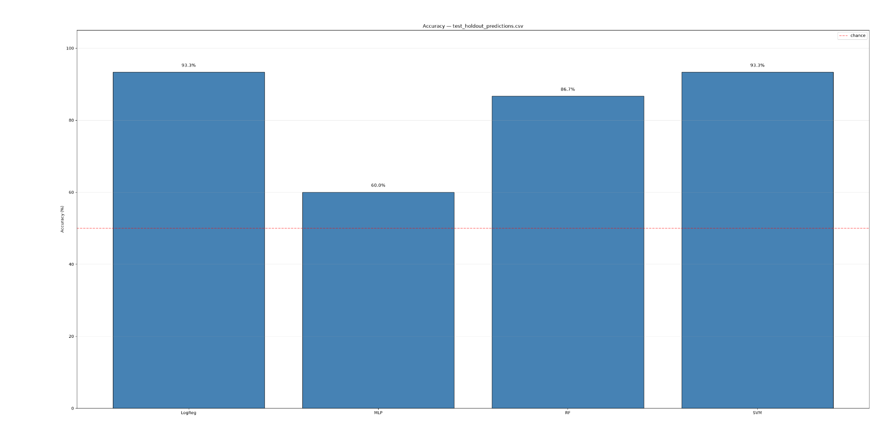
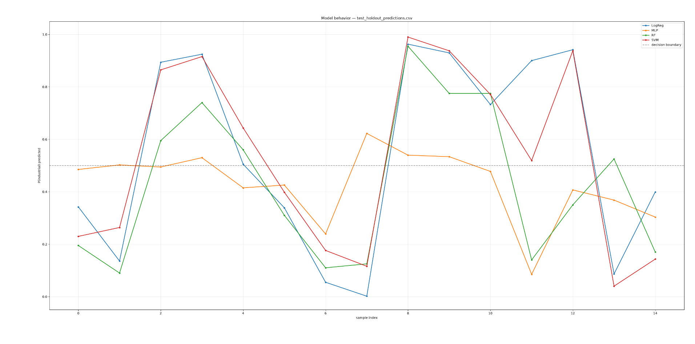
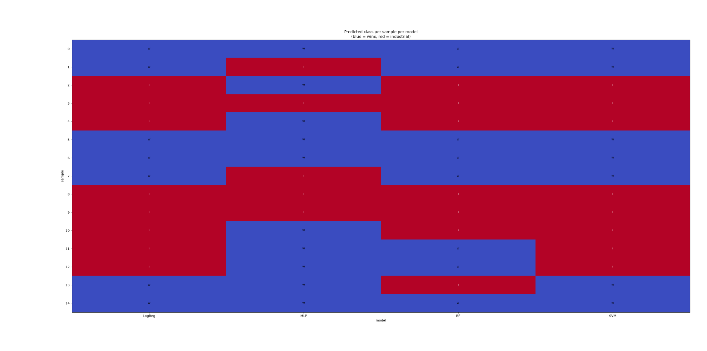
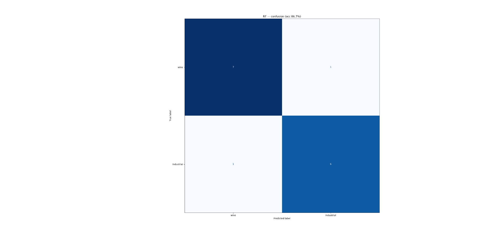
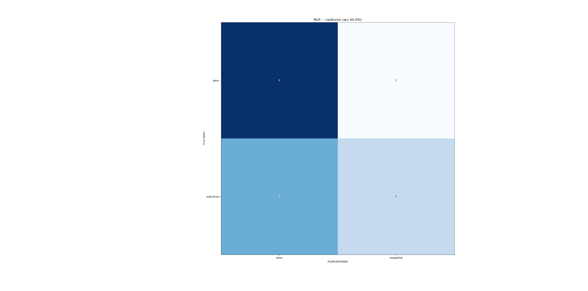
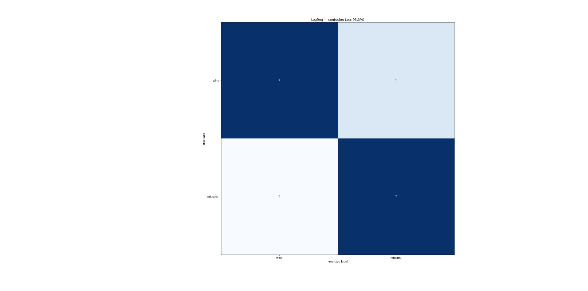

# Olfactory Pipeline — FlyWire Connectome-Based Chemical Classification

A feasibility study integrating the FlyWire FAFB fruit fly connectome with
real Nowotny/de Bruyne ORN recordings to classify wine vs. industrial
volatile chemicals.

## What this project does

1. Extracts the olfactory circuit (ORN -> PN -> Kenyon Cell) from the real
   FlyWire connectome.
2. Loads real measured ORN responses (71 odorants x 20 sensilla) from the
   de Bruyne 2014 dataset.
3. Pushes the ORN responses through the connectome to produce Kenyon Cell
   representations.
4. Trains 4 classifiers on both raw ORN features and connectome-derived
   KC features.
5. Reports honest cross-validated accuracy with shuffled-label controls.

## Headline result

We ran two evaluations. Both point the same direction.

**1. Connectome comparison (5-fold CV, on all 71 samples):**

| Feature set | Best model | Accuracy |
|---|---|---|
| Raw ORN (20-D) | SVM | **83.0%** |
| Connectome-derived KC (5,177-D) | RF | 81.9% |
| Shuffled-label control | — | ~50% (chance) |

The connectome did **not** improve classification. The signal is already
present at the receptor level, and the mushroom body's sparse expansion
coding did not amplify it on this dataset. An honest negative result.

**2. Held-out test (single 80/20 split, 15 samples never seen in training):**

| Model | Accuracy |
|---|---|
| LogReg | 93.3% (14/15) |
| SVM | 93.3% (14/15) |
| RF | 86.7% (13/15) |
| MLP | 60.0% (9/15) |

See `DATA.md` for what the data actually is.

### Model accuracy on the held-out test set

*4 classifiers, stratified 20% held-out set, never seen during training.*

### Behavior along the wine -> industrial gradient

*Synthetic samples generated by `generate_dummy.py`. Each model's probability
of predicting "industrial" per sample — a smooth curve means the model
interpolates sensibly between the two class prototypes.*

### Prediction heatmap (samples x models)

*W = wine, I = industrial. Where models disagree, the sample is ambiguous.*

### Confusion matrices (held-out test set)

| Random Forest | SVM | MLP | LogReg |
|---|---|---|---|
|  |  |  |  |

## Setup

    python3 -m venv .venv
    source .venv/bin/activate
    pip install -r requirements.txt

## Data (must be downloaded separately)

Raw datasets are not committed (too large). Download into data/ before
running the pipeline:

| Dataset | Source | Target folder |
|---|---|---|
| FlyWire FAFB v783 | https://codex.flywire.ai/api/download?dataset=fafb | data/flywire_raw/ |
| Nowotny/de Bruyne 2014 | https://data.csiro.au/collection/csiro:10689 | data/nowotny/ |
| DoOR 2.0 | http://neuro.uni-konstanz.de/DoOR/content/DoOR.php | data/door_raw/ |

Required FlyWire files: connections_princeton.csv, classification.csv,
consolidated_cell_types.csv.

See **DATA.md** for a full explanation of every column in every file.

## Workflow

    python train.py
    python predict.py data/test_holdout.csv
    python plot.py predictions/test_holdout_predictions.csv

    python generate_dummy.py --out dummy.csv
    python predict.py dummy.csv
    python plot.py predictions/dummy_predictions.csv

Or run everything at once:

    ./demo.sh

## Repository layout

    generate_dummy.py     synthetic ORN samples along wine->industrial gradient
    train.py              train 4 classifiers, save to models/
    predict.py            run inference on any CSV, save to predictions/
    plot.py               visualize any predictions CSV
    demo.sh               runs the whole pipeline end to end

    DATA.md               what every dataset, column, and number means
    WORKFLOW.md           one-shot command reference

    data/                 raw data (not committed -- see Data section)
    docs/images/          result figures embedded above
    models/               trained model files (regeneratable)
    predictions/          prediction outputs (regeneratable)
    outputs/              intermediate pipeline artifacts
    pipeline_artifacts/   one-time connectome extraction scripts

## Citation

If you use this code, please cite the underlying datasets:

- Dorkenwald et al. (2024). Neuronal wiring diagram of an adult brain. Nature.
- de Bruyne, M., et al. (2014). CSIRO Data Access Portal, csiro:10689.
- Munch & Galizia (2016). DoOR 2.0, Sci Rep.
